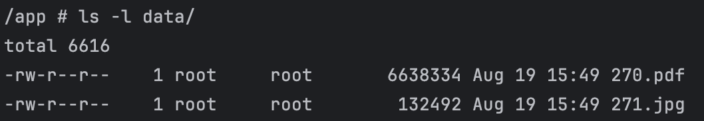

# File-manager

Application to manage (store, get, remove) your files with any extension.

Use Swagger to feel good :)

## Stack
- **Python3.12**
- **FastApi** framework
- **PostgreSQL** DB
- **SQLAlchemy** ORM
- **Alembic** migrations
- **aioboto3** for work with s3
- **Redis** for cache
- **Celery** for background and scheduled tasks
- **Pydantic** for validation
- **pytest** for tests
- **punq** for DI containers pattern

## Dependencies

- Docker
- Docker compose

## Running
1. `docker compose up --build`
2. Open `http://localhost:9001/` with minioadmin:minioadmin creds
3. Create _documents_ bucket

- Base URL: `http://localhost:3006/`
- Swagger URL: `http://localhost:3006/docs`
- Minio (UI for S3) URL: `http://localhost:9001/`

Endpoints:
- GET /documents/{document_id}
- POST /documents

Database tables:
- documents

## Swagger

## Upload files

DB (metadata with UID):

Disk storage:

S3 storage (Mino web UI):

Stream uploading by 1024 bytes parts:

## Get file
File metadata + download link

Put download link to browser:

## Celery task to remove useless files on schedule
Task run every day on midnight:

Example:

